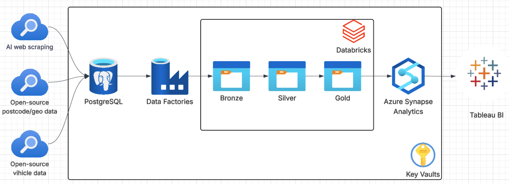
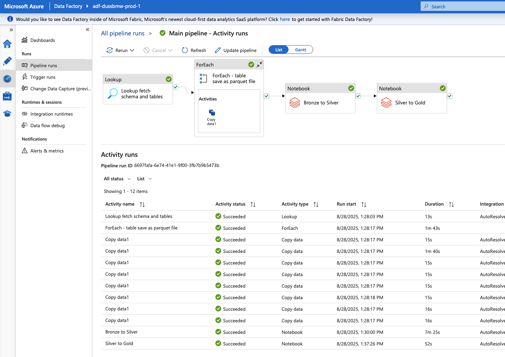

# Analytisch project voor niet-commerciële doeleinden uitgevoerd uitsluitend met open source data (Licentie CC 1.0, CC BY 4.0)

    Analytical project for non-commercial purposes conducted exclusively using open- source data (License CC 1.0, CC BY 4.0)

## Business Request

In dit project heeft het denkbeeldige bedrijf "DBWM" een behoefte geïdentificeerd om de invloed van concurrenten op de dealercentra te analyseren. Dit omvat het evalueren van de impact van concurrenten op basis van geografische locatie, het verstrekken van het assortiment en prijzen van voertuigen van de dichtstbijzijnde dealercentra, evenals andere bedrijven. Waar mogelijk analyseert het ook de koopkracht van steden, gemeenten en provincies waar de dealercentra van "DBWM" zich bevinden.

    English version:
    In this project, the imaginary company "DBWM" has identified a need to analyze the influence of competitors on its dealer centers. This includes evaluating the impact of competitors based on geographical location, providing the assortment and prices of vehicles from the nearest dealer centers, as well as other companies. Where possible, it also analyzes the purchasing power of cities, municipalities, and provinces where "DBWM" dealer centers are located.

## Solution Overview
Om aan dit verzoek te voldoen, verzamelen we open-source referenties en parseren we data die nuttig kunnen zijn voor toekomstige analyses. Dit omvat het bouwen van een robuuste data pipeline in Azure Cloud, met gebruik van data uit openbaar beschikbare geo-locatie directories op de website van Nationaal Georegister NL, CBS Centraal Bureau voor de Statistiek, en "RDW OPENDATA" GitHub repo, evenals data die geparseerd kunnen worden via AI-modellen.

    English version:
    To fulfill this request, we will collect open-source references and parse data that can be useful for future analysis. This includes building a robust data pipeline in Azure Cloud, using data from publicly available geo-location directories on the Nationaal Georegister NL website, CBS (Statistics Netherlands), and the "RDW OPENDATA" GitHub repo, as well as data that can be parsed via AI models.

## Technical Implementation and Budget
De basis zal gebruikmaken van Azure-resources zoals PostgreSQL, Data Factory, Databricks en Data Lake Gen2 storage, die Microsoft levert binnen het budget van 200 gratis credits per maand. Voor het parsen met gratis AI-modellen zijn de tokenlimieten ook voldoende om deze taak uit te voeren.

    English version:
    Technical Implementation and Budget
    The foundation will utilize Azure resources such as PostgreSQL, Data Factory, Databricks, and Data Lake Gen2 storage, which Microsoft provides within the budget of 200 free credits per month.
    For parsing with free AI models, the token limits are also sufficient to perform this task.

## Deze analyse is puur educatief van aard en is niet bedoeld voor commercieel gebruik.

    This analysis is purely educational in nature and is not intended for commercial use.

## Architecture

## Azure ETL piplene

    

## ETL piplene 

1. Data gathering
    Collect raw data from multiple sources, including AI-driven web scraping, open-source postcode/geospatial datasets, and open-source vehicle data.
    Raw data that we are going to analyze or might be useful; 

2. Data ingestion
    Ingest raw data from the various sources into Azure PostgreSQL;
    Utilize Azure Data Factory to orchestrate the movement of data from PostgresSQL DB to Bronze zone in .parquet format  

3. Data preprocessing and cleaning
    Deduplication;
    Data validation;
    Checking data types, etc.

4. Data transformation
    Standatise colmn names for consistency across datasets; 
    Add new calculation fileds, combine data etc.; 
    Processing structured and cleaned datasets from Broze to Silver zone;

5. Data loading and aggrigation 
    Procesing data from Silver to Gold zone;
    Synapse dinamicly create relavant views based on delta files in gold zone; 
    Prepare datasets for analysis, utilizing Tableau BI. 

## The list with open-source data:

    - Nationaal Georegister NL - Provincie - Bestuurlijke grenzen - historie 2013-2021
        https://www.nationaalgeoregister.nl/geonetwork/srv/dut/catalog.search#/metadata/fe24c2a7-b121-4177-887a-fa16d943729b?tab=general

    - Nationaal Georegister NL - Gemeenten - Bestuurlijke grenzen - historie 2013-2021
        https://www.nationaalgeoregister.nl/geonetwork/srv/dut/catalog.search#/metadata/fe24c2a7-b121-4177-887a-fa16d943729b?tab=general

    - CBS Centraal Bureau voor de Statistiek - Postcode -  Kerncijfers per postcode
        https://www.cbs.nl/nl-nl/dossier/nederland-regionaal/geografische-data/gegevens-per-postcode

    - RDW open data - car plates numbers, vehicle data, etc.
        https://github.com/maximnl/RDW_OPENDATA

    - RDW - Cijfers en letters op de kentekenplaat
        https://www.rdw.nl/de-kentekenplaat/cijfers-en-letters-op-de-kentekenplaat?utm_source=intern&utm_campaign=redirect&utm_medium=https%3A%2F%2Fwww.rdw.nl%2Fparticulier%2Fvoertuigen%2Fauto%2Fde-kentekenplaat%2Fcijfers-en-letters-op-de-kentekenplaat

        https://www.rdw.nl/de-kentekenplaat/overzicht-van-kentekenseries

    Other useful links

    - Open datasets van de overheid met actuele geo-informatie
        https://www.pdok.nl/
        https://app.pdok.nl/viewer/#x=254664.91&y=477084.13&z=5.6933&background=BRT-A%20standaard&layers=